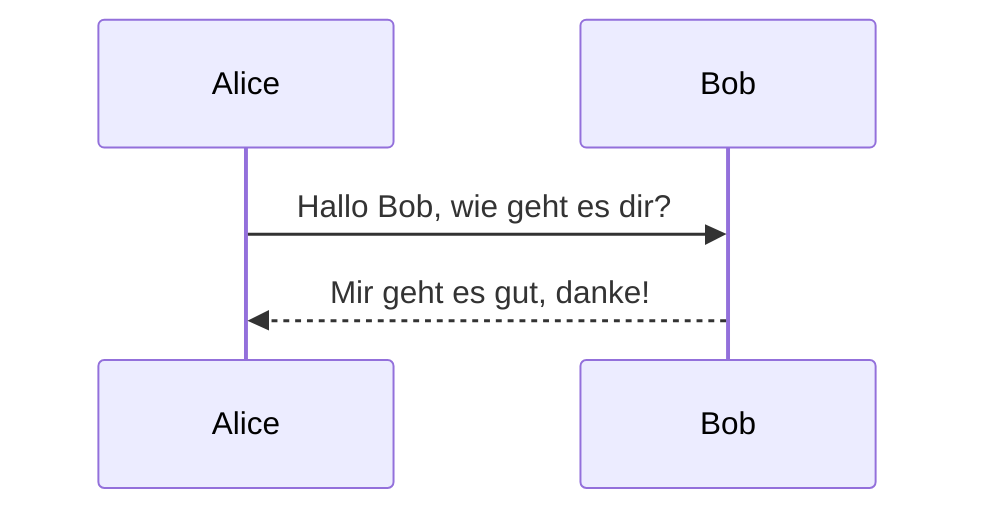
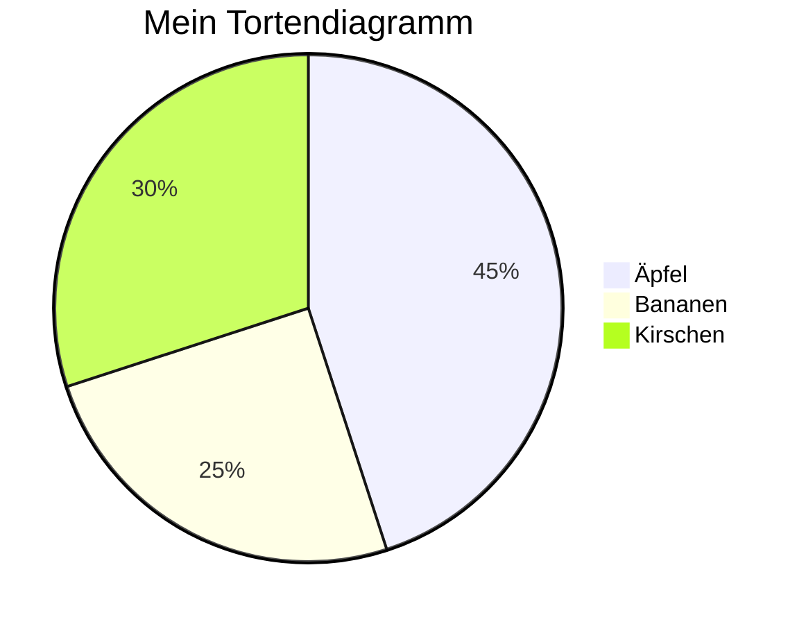
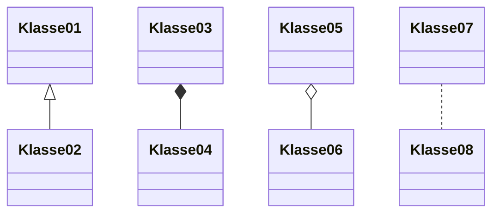
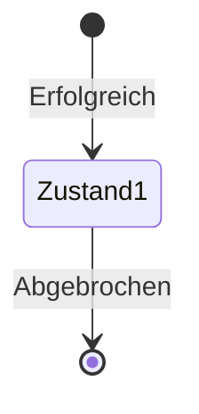
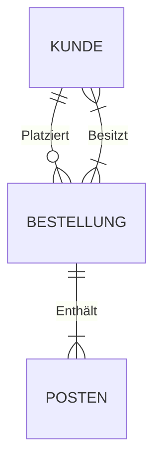

In der heutigen digitalen Ära ist die effektive Visualisierung von Daten und Prozessen entscheidend, um komplexe Informationen zu verstehen und zu vermitteln. Wenn Sie ein Entwickler, Dokumentationsautor oder einfach jemand sind, der schnell und einfach visuelle Darstellungen von Ideen erstellen möchte, werden Sie Mermaid lieben. Mermaid ist eine Open-Source-JavaScript-Bibliothek, mit der Sie Diagramme und Charts mithilfe einer einfachen textbasierten Syntax generieren können. In diesem Beitrag möchten wir Ihnen Mermaid vorstellen und Beispiele für die Syntax verschiedener Diagrammtypen zeigen.

## Was ist Mermaid?

Mermaid ist ein leistungsstarkes Chart-Tool, das Ihre textbasierten Beschreibungen in visuell ansprechende und informative Diagramme verwandelt. Egal, ob Sie Flussdiagramme, Sequenzdiagramme, Gantt-Diagramme oder andere visuelle Darstellungen benötigen, Mermaid ermöglicht es Ihnen, sie mühelos zu erstellen. Das Beste daran? Sie müssen kein Grafikdesigner oder erfahrener Entwickler sein, um es zu verwenden.

## Mermaid Diagrammtypen und Beispiele

### 1. Flussdiagramm

Flussdiagramme werden häufig verwendet, um Prozesse und Abläufe darzustellen. Hier ist ein Beispiel für ein Flussdiagramm, das mit Mermaid erstellt wurde:


In diesem Beispiel haben wir ein einfaches Flussdiagramm mit Knoten und Pfeilen, die einen Prozess darstellen.

### 2. Sequenzdiagramm

Sequenzdiagramme eignen sich hervorragend zur Veranschaulichung von Interaktionen zwischen verschiedenen Entitäten. Hier ist ein Sequenzdiagramm:



Dieses Sequenzdiagramm zeigt ein Gespräch zwischen Alice und Bob.

### 3. Gantt-Diagramm

Gantt-Diagramme werden häufig für Projektzeitpläne verwendet. Hier ist ein Beispiel für ein Gantt-Diagramm:

```mermaid
gantt
  dateFormat  YYYY-MM-DD
  title Projektzeitplan
  section Planung
  Aufgaben definieren    :a1, 2023-01-01, 30d
  section Entwicklung
  Funktionen implementieren   :nach a1, 30d
  section Test
  Funktionen testen    :nach a2, 20d
```

Dieses Gantt-Diagramm zeigt den Zeitplan eines Projekts mit verschiedenen Aufgabenbereichen.

### 4. Tortendiagramm

Tortendiagramme eignen sich hervorragend zur Darstellung von Anteilen. Hier ist ein einfaches Tortendiagramm:



Dieses Tortendiagramm veranschaulicht die Verteilung von Obstarten.

### 5. Klassendiagramm

Klassendiagramme sind nützlich, um Beziehungen zwischen Klassen darzustellen. Hier ist ein Beispiel:



Dieses Klassendiagramm veranschaulicht Klassenbeziehungen.

### 6. Zustandsdiagramm

Zustandsdiagramme helfen, das Verhalten einer Entität oder eines Systems zu beschreiben. Hier ist ein Beispiel für ein Zustandsdiagramm:



Dieses Zustandsdiagramm repräsentiert Übergänge zwischen Zuständen.

### 7. ER-Diagramm

Entity-Relationship (ER)-Diagramme sind wichtig für die Datenbankmodellierung. Hier ist ein Beispiel:



Dieses ER-Diagramm zeigt Beziehungen zwischen Kunden, Bestellungen und Bestellposten.

### 8. Entity Relationship Diagram (ERD)

Eine erweiterte Version von ER-Diagrammen in Mermaid sieht folgendermaßen aus:

```mermaid
erd
entity "Kunde" as kunde {
  +ID: Zeichenkette
  Name: Zeichenkette
  E-Mail: Zeichenkette
}

entity "Bestellung" as bestellung {
  +ID: Zeichenkette
  Datum: Datum
  Gesamt: Währung
}

kunde ||--o{ bestellung : "Platziert"
```

In diesem erweiterten ERD können Sie die Attribute der Entitäten und deren Beziehungen sehen.

## Erstellen Sie atemberaubende Visualisierungen mit Mermaid

Mermaid ist ein vielseitiges Werkzeug, mit dem Sie eine Vielzahl von Diagrammen und Grafiken erstellen können. Es ist ein unschätzbares Hilfsmittel für Entwickler, technische Autoren und alle, die komplexe Informationen visuell darstellen müssen. Mit seiner intuitiven Syntax und umfangreichen Diagrammfunktionen vereinfacht Mermaid den Prozess der Erstellung informativer und ansprechender Visualisierungen.

Egal, ob Sie einen Projektzeitplan entwerfen, ein komplexes System erläutern oder einfach

 nur Daten visualisieren möchten, Mermaid ist Ihre Lösung, um Text in wunderschöne und informative Diagramme und Grafiken zu verwandeln. Starten Sie noch heute mit Mermaid und verbessern Sie Ihre Kommunikation durch die Kraft der Visualisierung.
