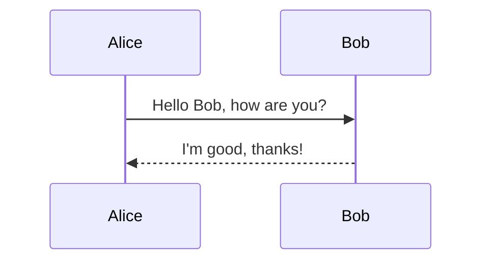
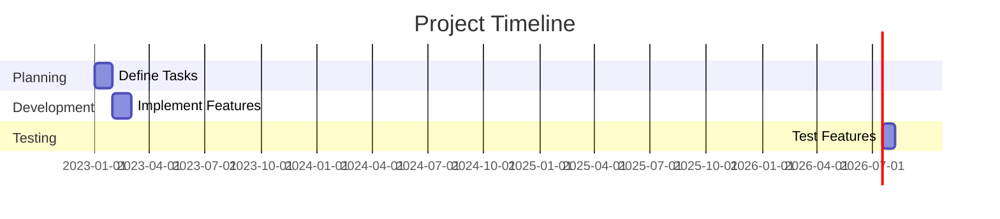
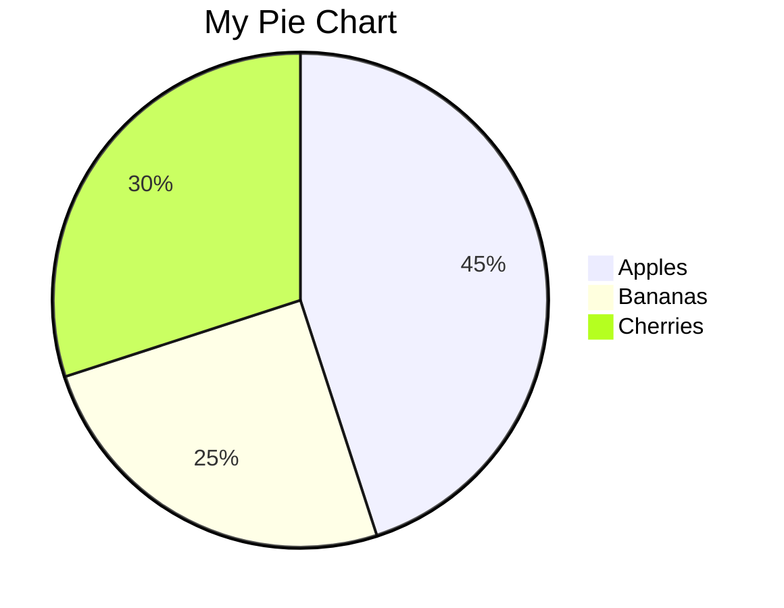
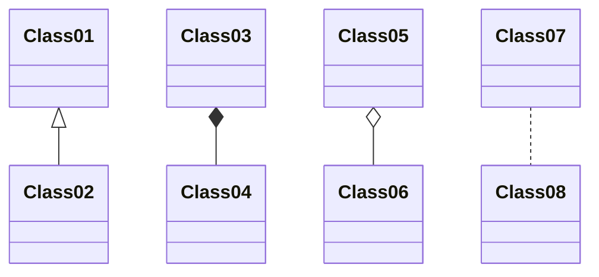
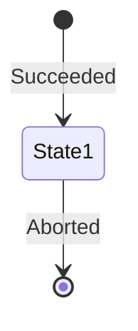
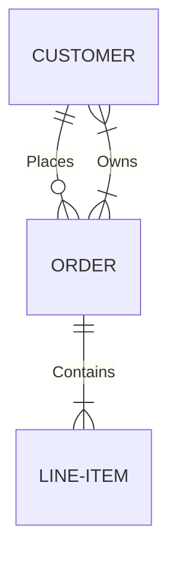

In today's digital age, effective visualization of data and processes is essential for understanding and conveying complex information. If you're a developer, documentation writer, or simply someone who wants to create visual representations of ideas quickly and easily, you'll love Mermaid. Mermaid is an open-source JavaScript library that empowers you to generate diagrams and charts using a simple text-based syntax. In this post, we'll introduce you to Mermaid and provide examples of its syntax for various chart types.

## What is Mermaid?

Mermaid is a powerful charting tool that transforms your text-based descriptions into visually appealing and informative diagrams. Whether you need flowcharts, sequence diagrams, Gantt charts, or other visual representations, Mermaid can help you create them effortlessly. The best part? You don't need to be a graphic designer or a seasoned developer to use it.

## Mermaid Chart Types and Examples

### 1. Flowchart

Flowcharts are commonly used to represent processes and workflows. Here's an example of a flowchart created with Mermaid:


In this example, we have a simple flowchart with nodes and arrows that represent a process.

### 2. Sequence Diagram

Sequence diagrams are excellent for illustrating interactions between different entities. Here's a sequence diagram:



This sequence diagram shows a conversation between Alice and Bob.

### 3. Gantt Chart

Gantt charts are commonly used for project timelines. Here's an example of a Gantt chart:



This Gantt chart depicts a project's timeline with various task sections.

### 4. Pie Chart

Pie charts are great for displaying proportions. Here's a simple pie chart:



This pie chart visualizes the distribution of fruit types.

### 5. Class Diagram

Class diagrams are useful for depicting relationships between classes. Here's an example:



This class diagram illustrates class relationships.

### 6. State Diagram

State diagrams help describe the behavior of an entity or system. Here's a state diagram example:



This state diagram represents transitions between states.

### 7. ER Diagram

Entity-Relationship (ER) diagrams are vital for database modeling. Here's an example:



This ER diagram shows relationships between customers, orders, and line items.

### 8. Entity Relationship Diagram (ERD)

An extended version of ER diagrams in Mermaid is as follows:

```mermaid
erd
entity "Customer" as customer {
  +ID: string
  Name: string
  Email: string
}

entity "Order" as order {
  +ID: string
  Date: date
  Total: currency
}

customer ||--o{ order : "Places"
```

In this extended ERD, you can see the attributes of entities and their relationships.

## Create Stunning Visuals with Mermaid

Mermaid is a versatile tool that empowers you to create a wide range of charts and diagrams, making it an invaluable asset for developers, technical writers, and anyone needing to convey complex information visually. With its intuitive syntax and extensive charting capabilities, Mermaid simplifies the process of creating informative and engaging visuals.

So, whether you're designing a project timeline, explaining a complex system, or simply visualizing data, Mermaid is your go-to solution for turning text into beautiful, informative charts and diagrams. Get started with Mermaid today and enhance your communication through the power of visualization.
