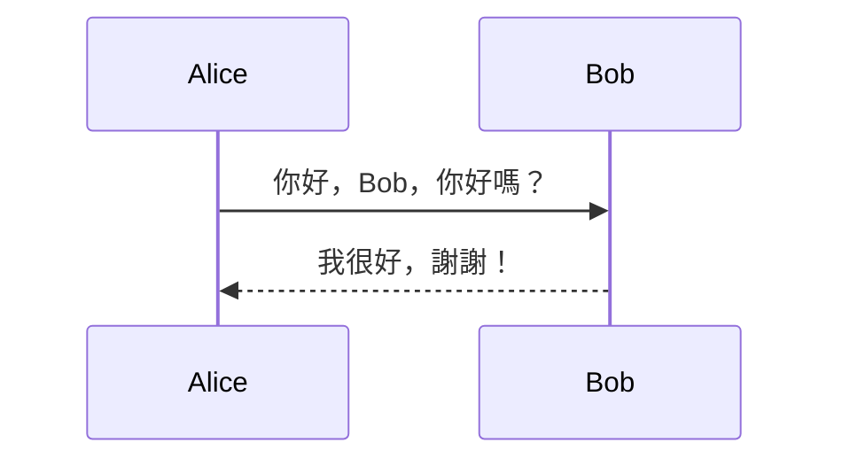
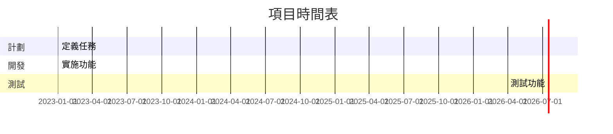
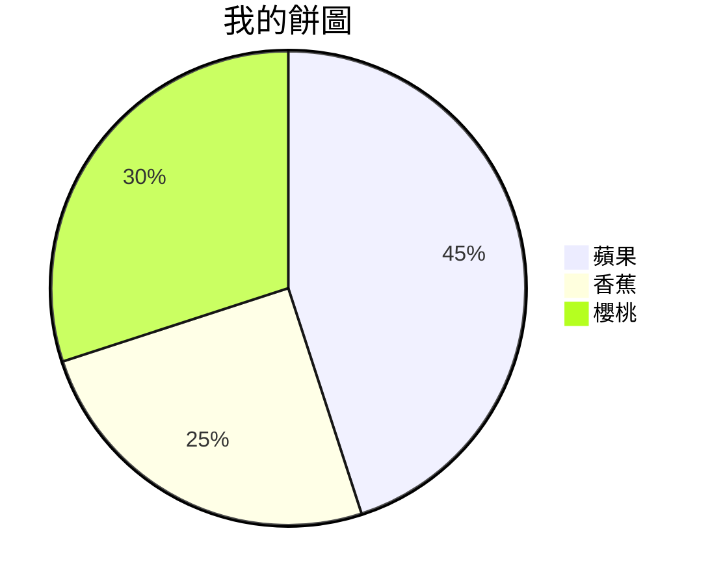
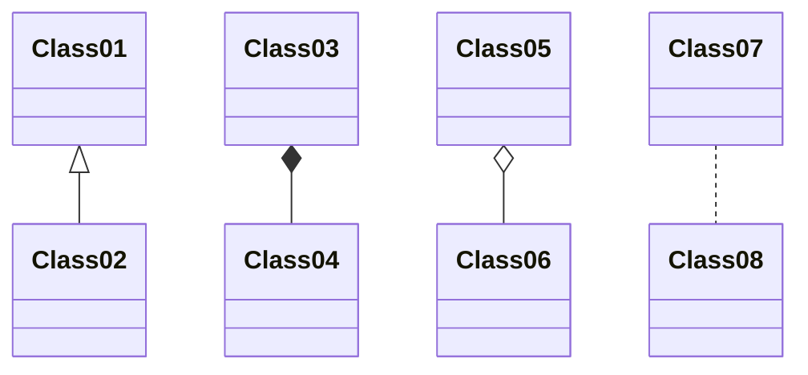
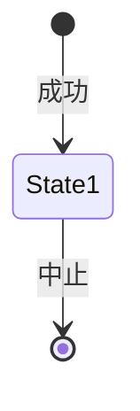
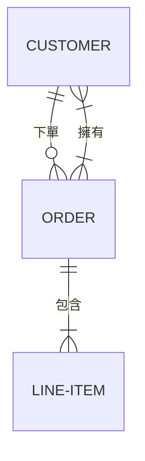

在當今的數位時代，對於理解和傳達複雜信息，有效地視覺化數據和流程至關重要。如果您是一名開發人員、文件編寫者，或者只是想輕鬆快速地創建想法的視覺表達的人，您一定會喜歡Mermaid。Mermaid是一個開源的JavaScript庫，它使您能夠使用簡單的基於文本的語法生成圖表和圖表。在本文中，我們將向您介紹Mermaid，並提供不同類型的圖表的語法示例。

## 什麼是Mermaid？

Mermaid是一個強大的圖表工具，它可以將您的基於文本的描述轉換為視覺上吸引人且具有信息性的圖表。無論您需要流程圖、順序圖、甘特圖還是其他視覺表達，Mermaid都可以幫助您輕鬆創建它們。最好的部分？您不需要成為圖形設計師或經驗豐富的開發人員來使用它。

## Mermaid圖表類型和示例

### 1. 流程圖

流程圖通常用於表示流程和工作流程。以下是使用Mermaid創建的流程圖示例：


在此示例中，我們有一個簡單的流程圖，其中的節點和箭頭代表一個過程。

### 2. 順序圖

順序圖非常適合說明不同實體之間的互動。以下是一個順序圖：



這個順序圖展示了Alice和Bob之間的對話。

### 3. 甘特圖

甘特圖通常用於項目時間表。以下是一個甘特圖的示例：



這個甘特圖描述了項目的時間表，包括不同的任務部分。

### 4. 餅圖

餅圖非常適合顯示比例。以下是一個簡單的餅圖：



這個餅圖可視化了水果種類的分佈。

### 5. 類圖

類圖用於描述類之間的關係。以下是一個示例：



這個類圖說明了類之間的關係。

### 6. 狀態圖

狀態圖有助於描述實體或系統的行為。以下是一個狀態圖示例：



這個狀態圖代表不同狀態之間的過渡。

### 7. 實體關係圖

實體關係（ER）圖對於數據庫建模非常重要。以下是一個示例：



這個ER圖顯示了客戶、訂單和訂單項之間的關係。

### 8. 實體關係圖（ERD）

Mermaid的擴展ER圖示例如下：

```mermaid
erd
entity "Customer" as customer {
  +ID: 字串
  名稱: 字串
  電子郵件:

 字串
}

entity "Order" as order {
  +ID: 字串
  日期: 日期
  總額: 貨幣
}

customer ||--o{ order : "下單"
```

在這個擴展的ERD中，您可以看到實體的屬性以及它們之間的關係。

## 用Mermaid創建引人注目的視覺效果

Mermaid是一個多功能工具，它可以幫助您創建各種圖表和圖表，使其成為開發人員、技術編寫者和任何需要通過視覺化傳遞複雜信息的人的無價資產。憑藉其直觀的語法和廣泛的繪圖功能，Mermaid簡化了創建信息豐富且引人入勝的視覺效果的過程。

因此，無論您是設計項目時間表，解釋複雜系統，還是僅僅視覺化數據，Mermaid都是您將文本轉化為美麗、信息豐富的圖表和圖表的首選工具。立即開始使用Mermaid，通過視覺化的力量增強您的溝通能力。
